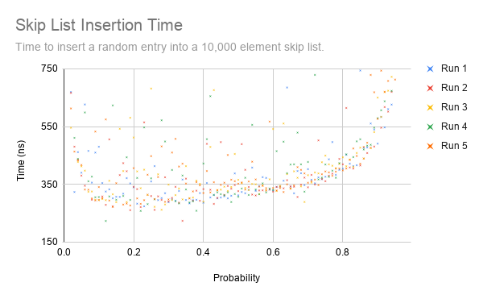
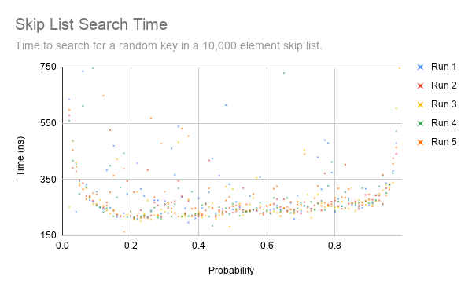
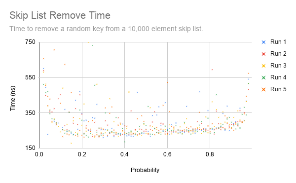

# Java Skip List

This is a skip list implementation written in Java. Also see https://crimsonglow.ca/~kjiwa/2011/06/skip-list.html.

> Skip lists are a data structure that can be used in place of balanced trees. Skip lists use probabilistic balancing rather than strictly enforced balancing and as a result the algorithms for insertion and deletion in skip lists are much simpler and significantly faster than equivalent algorithms for balanced trees. (Pugh)

Each method was profiled using different iteration probabilities to determine which value would yield the best, single-threaded performance. The profiler was run on an Intel i9-9900K CPU. On this platform, a value of 0.2 seemed to yield the best results for all operations. Detailed results are available [here](https://docs.google.com/spreadsheets/d/e/2PACX-1vRAu08PQzpnv4zY6eyUL8jLjV7qRw_Dfhfbaao6AMdtaZ9QvyzAksfys0sUp1WGNfsRT7cmDVcWyPvG/pubhtml), and the profiling code is available in [SkipListProfiler.java](SkipListProfiler.java).

  
  
  

